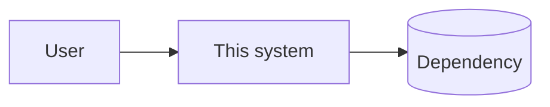

# System Overview

> **Last verified:** `{{YYYY-MM-DD}}` by `{{who}}`
>
> This file ships unfilled. Every `{{marker}}` below is a defect until it is
> replaced with a fact about your system.

The orientation page. An agent or engineer who reads only this file should be able to
make a small change safely and know when they are out of their depth.

Keep it to one screen of prose per section. Depth belongs in the per-component
documents; this file is a map, and a map that is as detailed as the territory is
useless.

---

## 1. What this system does

`{{One paragraph, in terms of the outcome for its users — not its technology. If
this paragraph needs a technology name to make sense, it is written at the wrong
level.}}`

---

## 2. Context

Who and what this system talks to. Everything outside the boundary is somebody
else's problem; everything inside it is ours.

| External party | Direction | Protocol | What flows | Failure behaviour |
| --- | --- | --- | --- | --- |
| `{{}}` | `{{in / out / both}}` | `{{}}` | `{{}}` | `{{what we do when it is unavailable}}` |

The last column is the one people skip and the one that matters. An integration with
no documented failure behaviour has an undocumented one, which is usually "hang until
timeout, then propagate the error to the user."

---

## 3. Components

| Component | Responsibility | Owns which data | Detail |
| --- | --- | --- | --- |
| `{{}}` | `{{one sentence — if it needs "and", consider whether it is two components}}` | `{{}}` | `{{link to its design doc}}` |

**Ownership means exactly one component writes it.** Two writers to one table is not
a component boundary, it is a shared mutable global with extra latency.

---

## 4. Request flow

Trace the single most important request end to end. One flow, in detail, teaches more
than five flows in summary.

`{{1. → 2. → 3. ...}}`

---

## 5. Data

- **Stores:** `{{what, and what each is for}}`
- **Source of truth for each entity:** `{{}}`
- **What is derived and can be rebuilt:** `{{caches, projections, search indexes —
  and how long a rebuild takes, because that is your recovery time}}`

---

## 6. Trust boundaries

Where data crosses from less-trusted to more-trusted. Every crossing is a place
validation MUST happen, per
[../STANDARDS.md#10](../STANDARDS.md#10-security-standards).

| Boundary | What crosses | Validated where | Authenticated how |
| --- | --- | --- | --- |
| `{{}}` | `{{}}` | `{{}}` | `{{}}` |

---

## 7. Cross-cutting concerns

How the system handles the things every component needs. Inconsistency here is a
common and expensive form of architectural drift.

- **Authentication and authorization:** `{{}}`
- **Configuration:** `{{}}` — per [../STANDARDS.md#25](../STANDARDS.md#25-configuration-standards)
- **Error handling:** `{{}}`
- **Logging, metrics, tracing:** `{{}}`
- **Background work and scheduling:** `{{}}`
- **Idempotency:** `{{which operations are idempotent, and by what mechanism}}`

---

## 8. Scale and limits

Current, measured — not projected.

| Dimension | Now | Known ceiling | What breaks first |
| --- | --- | --- | --- |
| `{{requests/sec}}` | `{{}}` | `{{}}` | `{{}}` |
| `{{data volume}}` | `{{}}` | `{{}}` | `{{}}` |

**"What breaks first" is the most valuable column here.** A system's next scaling
problem is nearly always predictable, and predicting it costs an afternoon while
discovering it costs an incident.

See [../STANDARDS.md#23](../STANDARDS.md#23-scalability-standards).

---

## 9. Failure modes

| If this fails | Effect | Detected by | Response |
| --- | --- | --- | --- |
| `{{}}` | `{{degraded / unavailable / silent data loss}}` | `{{alert name}}` | `{{runbook link}}` |

Any row where "detected by" is `{{a user complaint}}` is a monitoring gap, and
naming it here is how it gets fixed.

---

## 10. Known limitations

Deliberate, documented, and not defects. `{{}}`

Anything here that has started charging interest belongs in
[../memory/technical-debt.md](../memory/technical-debt.md) instead.

---

## 11. Evolution

Where this architecture is heading and what would force a change.

`{{The trigger, not the timeline. "When write volume exceeds N/sec we will need to
partition by tenant" is useful; "next year we will modernize" is not.}}`

---

## Maintenance

Update this file **in the same change** that alters what it describes, per
[../WORKFLOW.md#5](../WORKFLOW.md#5-architecture-workflow). Re-verify it at every
release regardless, and move the date at the top only when you have actually checked
it against the code.
